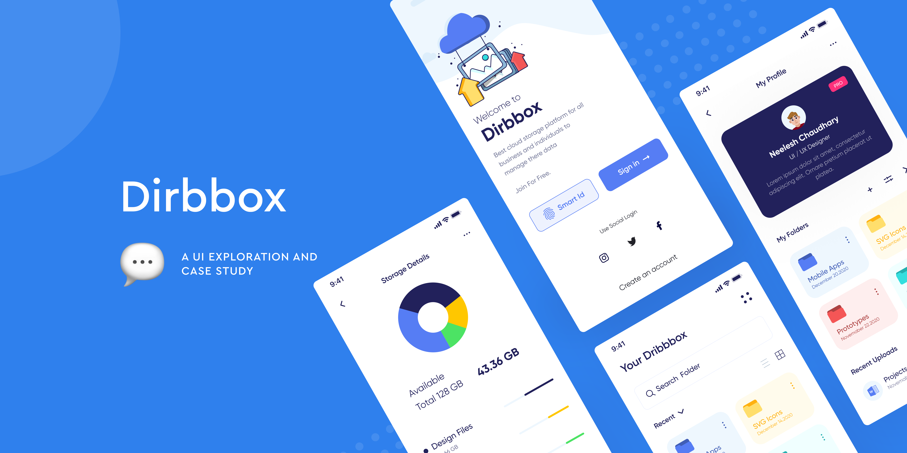

<p align="center">
    
    
    
    
</p>

# Flutter Dribbox Online Cloud Storage UI

Flutter Dribbox Online Cloud Storage UI is a modern and responsive mobile application built using Flutter, showcasing an intuitive user interface for a cloud storage service. The app is based on slicing from a Figma design, optimized for mobile screens. The UI is crafted to offer a seamless user experience, allowing users to access, manage, and store files effortlessly in the cloud. The clean, minimalist design includes features like file upload and download, folder management, and smooth cloud storage integration.

This app highlights modern design elements such as iconic buttons, smooth animation transitions, and efficient file management. By leveraging Flutter, the app ensures fast and responsive performance across various devices, making it an ideal choice for developers aiming to build aesthetically pleasing and high-performing cloud storage applications.

<a href="https://github.com/sh4dowByte/flutter_ui_dribbox_online_cloud_storage/releases/download/v1.0.0%2B1-4/app-release.apk">
    
</a>

## 🎨 Design

The design of this application is based on the provided Figma file. The slicing process was carried out meticulously to ensure the application accurately represents the design.

## 🚀 Feature

- **Responsive Design**: Supports various screen sizes with responsive UI elements.
- **Dark & Light Theme**: Provides both dark and light modes for a more comfortable user experience.
- **Seamless Navigation**: Implements navigation using Flutter Navigator.
- **Reusable Components**: Modular components for easier development and maintenance.
- **Draggable and Animate Card**: This feature allows users to interact with cards by dragging and animating them within the UI. It enhances the user experience by adding a dynamic and interactive element, allowing smooth transitions and visual feedback when items are moved or rearranged in the interface.

## 🛠️ Technologies

This project is built using the following technologies:

- **[Flutter](https://flutter.dev/)**: A framework for cross-platform application development.
- **[Dart](https://dart.dev/)**: The primary programming language for Flutter.
- **[Google Fonts](https://fonts.google.com/)**: For custom font integration.
- **[Figma](https://www.figma.com/)**: Used as the application's design reference.

## 📂 Folder Structure

```plaintext
.
├── assets/              # Contains images, icons, and other assets  
├── lib/  
│   ├── config/          # Application configuration (theme, routes, etc.)  
│   ├── screens/         # Main application pages  
│   ├── widgets/         # Reusable UI components  
│   ├── main.dart        # Main application file  
└── pubspec.yaml         # Flutter project configuration  
```

## 🖼️ Screenshot

| Light Mode                                     | Dark Mode                                      |
| ---------------------------------------------- | ---------------------------------------------- |
| 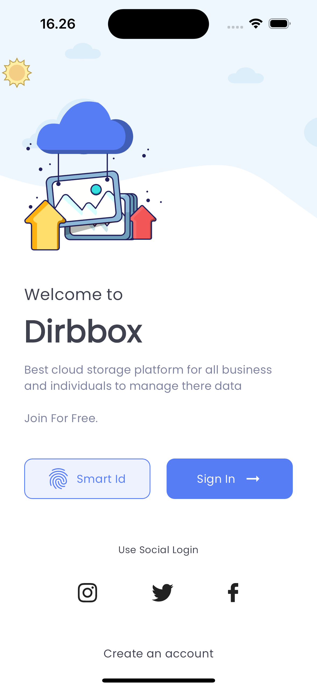 | 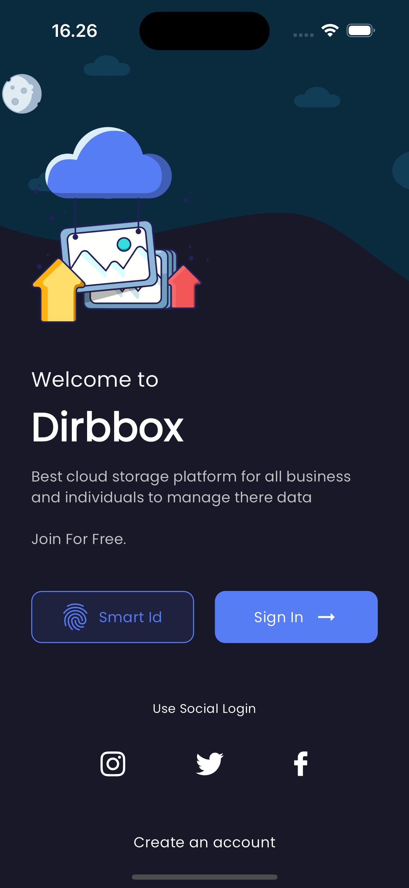 |
| 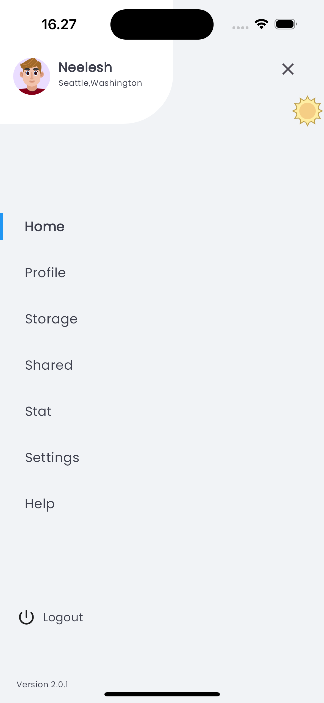 | 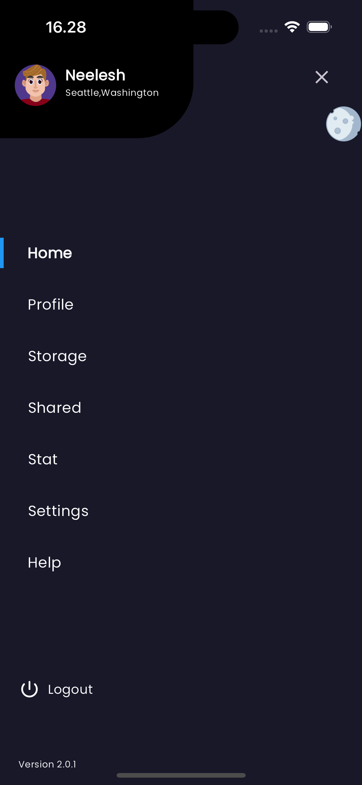 |
| 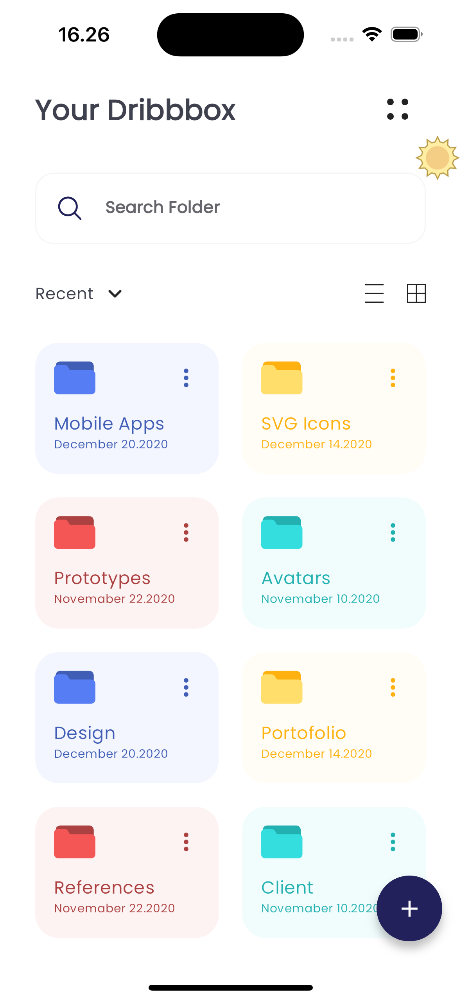 | 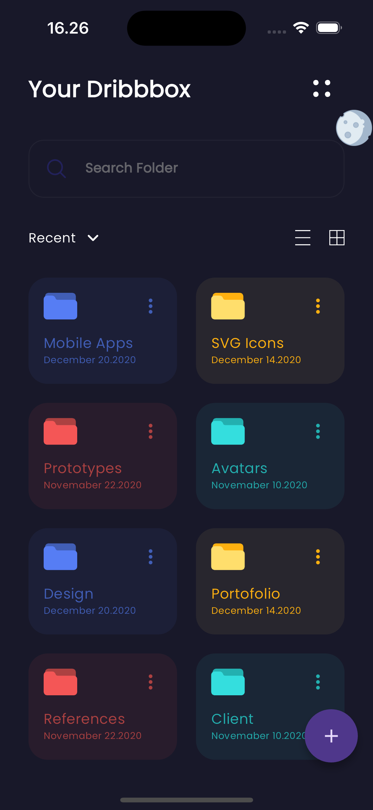 |
| 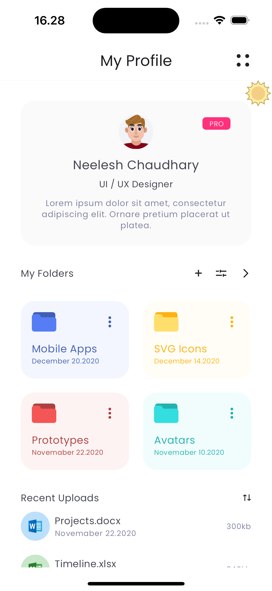 | 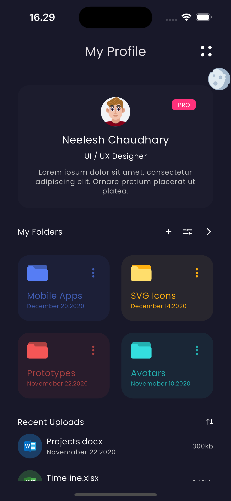 |
| 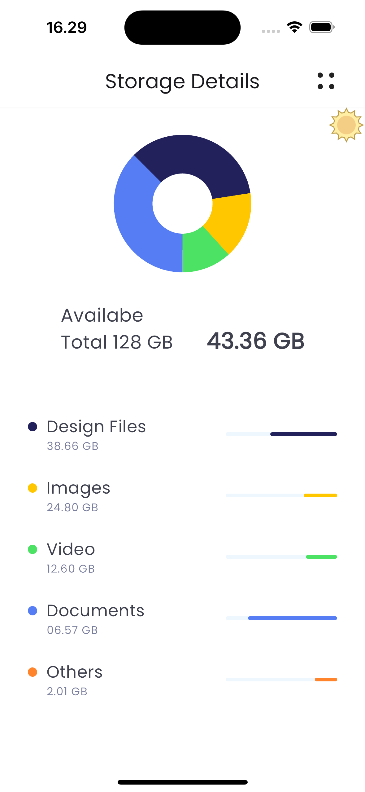 | 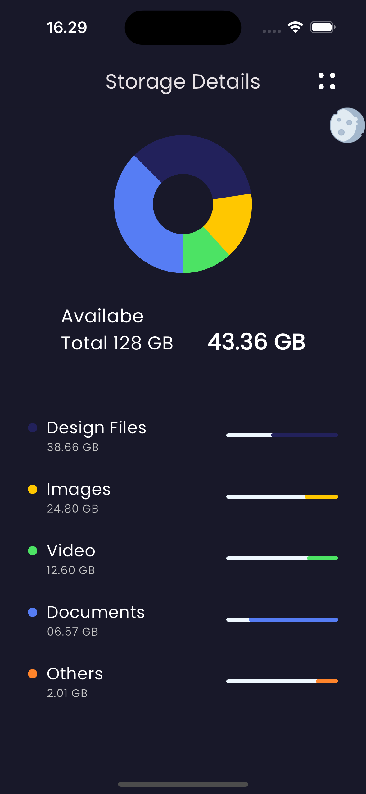 |
| 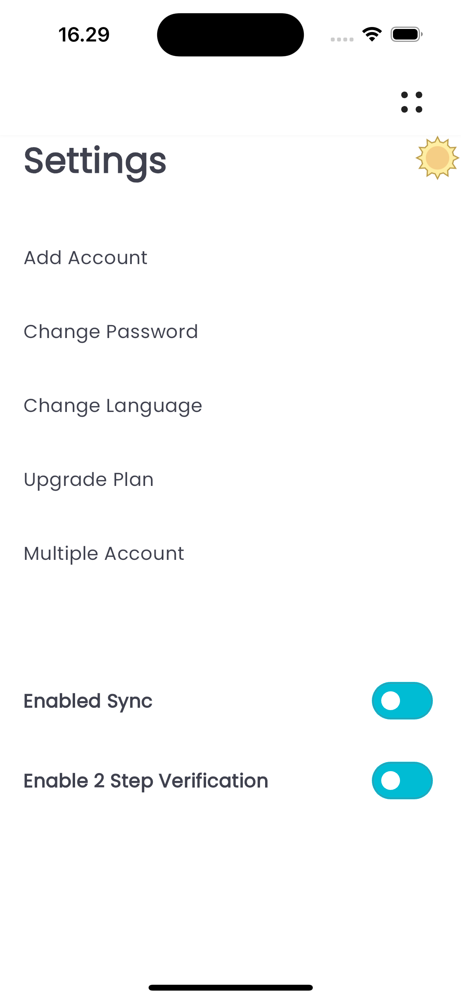 | 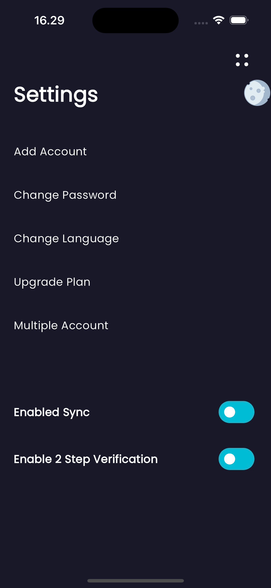 |
| 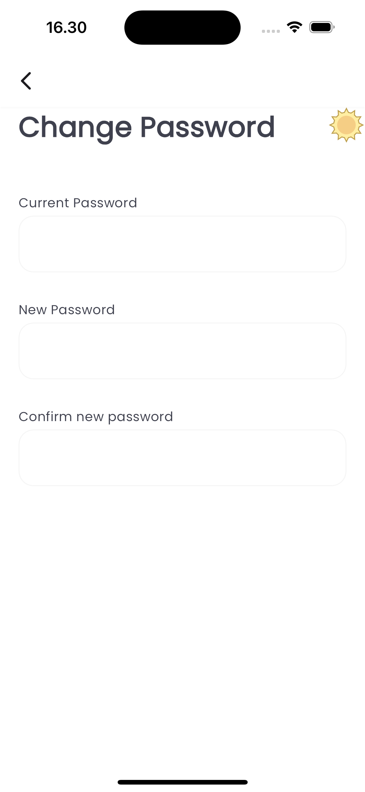 | 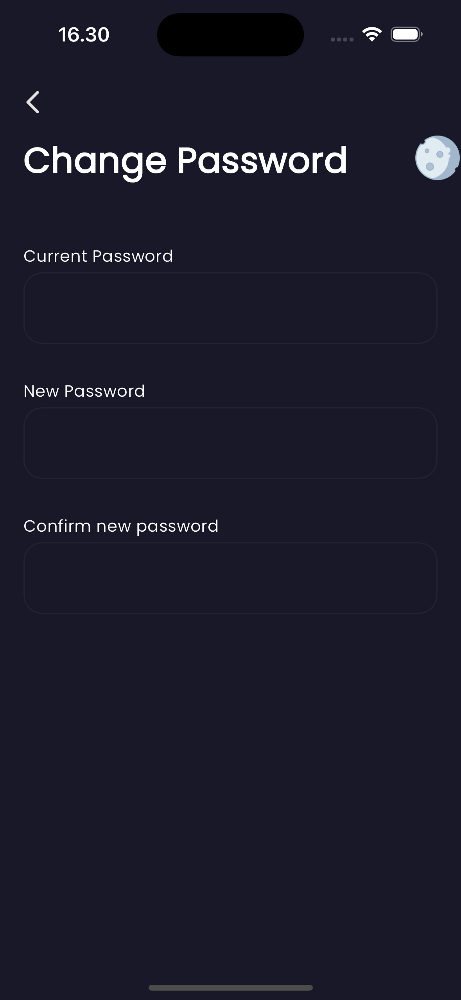 |

## License

This project is licensed under the Creative Commons Attribution-NonCommercial 4.0 International (CC BY-NC 4.0).
You are free to use this project for personal or educational purposes, but commercial use is not allowed.

For more details, refer to the [full license text](LICENSE).

## Disclaimer

The design of this application is based on a free Figma template available in the Figma Community, originally created by **[Hero Ninja]**. All rights to the original design are retained by the respective creator. This implementation is intended solely for educational and non-commercial purposes.

This project utilizes a design sourced from the Figma Community, created by **[Hero Ninja]**. Licensing terms of the original design may apply. Please review the original Figma design [here](https://www.figma.com/community/file/892116687909024921) to ensure compliance with its terms before utilizing this project in any capacity.
